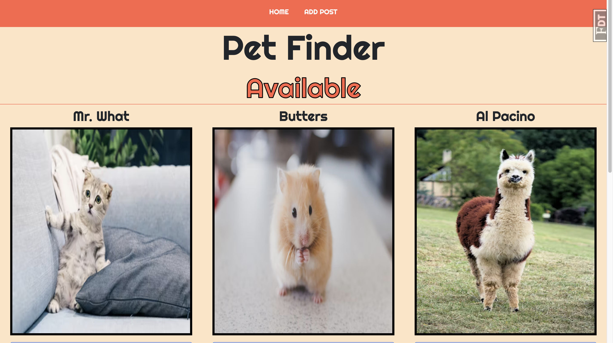
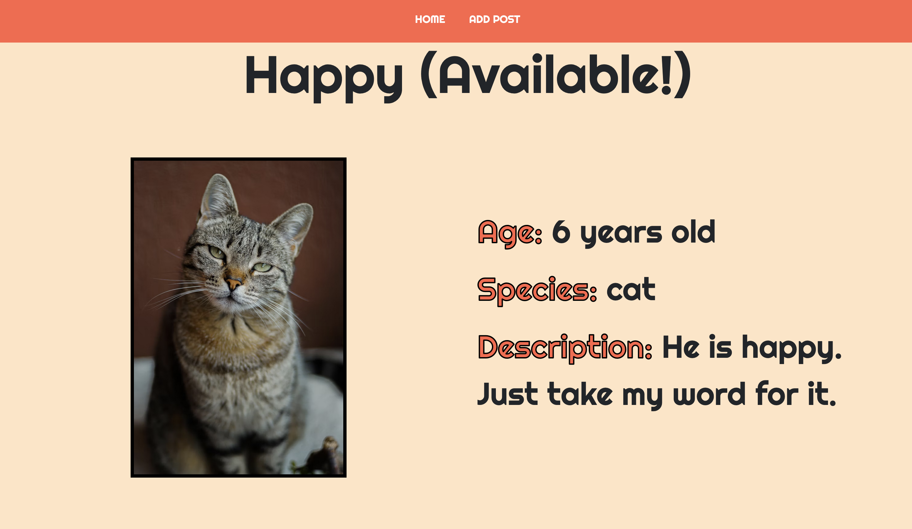
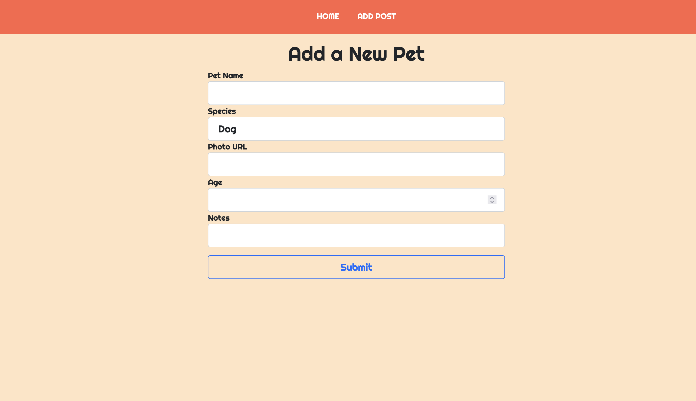

# Adoption Agency

## 🧐 Project Description

This is a mock pet adoption website that uses Flask, Flask-WTForms, SQLAlchemy, and PostgreSQL. Users can add a new pet profile, edit an existing pet profile, and mark a pet as adopted!

## 🐾 Pet Profile Page

## 📝 Form Page

